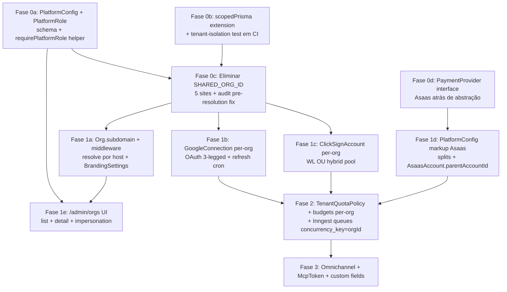

# PRD — Multitenant Foundational Refactor (Fase 0+1) para 600 Tenants

> **Status:** aprovado via Ultraplan em 2026-05-16. Sessão remota `01F9rbG6zebEp2SDQ2yZNjEn`.
> **Tipo:** PRD ticket-ready. Cobre Fase 0 (4 PRs paralelizáveis) + Fase 1 (5 frentes com dependências). Fase 2-3 ficam em alto nível pra contexto sequencial.
> **Audiência:** engenheiros implementadores.
> **Documentos de referência:**
> - Relatório arquitetural completo: `Downloads/architecture600tenants.md` (versão refinada via ultraplan, anchora em arquivo:linha do `main`)
> - Plan file de planejamento: `C:\Users\User\.claude\plans\voc-um-arquiteto-fuzzy-cook.md` (inclui Apêndice B com análise Celcoin)
> - Cronograma de implementação: `docs/cronograma-multitenant-600.md`

## Contexto

O código está single-tenant compartilhado (`SHARED_ORG_ID=cmnt1ldo4000111bw4yo517k0`) mas o schema já carrega `orgId` em quase todos os modelos de domínio (`AsaasAccount`, `Pipeline`, `Lead`, `Contract`, `CertidaoJob`, `Notification`, `AuditLog`, `OrgMembership`, etc. — `apps/web/prisma/schema.prisma`, 74 models). As únicas três classes reais de blocker pra escalar 600 tenants são:

1. **5 sites hardcoded** de `SHARED_ORG_ID` (`apps/web/src/app/api/webhooks/clicksign/route.ts:21,61,83` + 4 scripts: `admin-create-member.ts`, `migrate-pipeline-stages.ts`, `reset-system.ts`, `seed-aditamento-templates.ts`).
2. **Credenciais globais em env** pra Google (`apps/web/src/lib/google/client.ts:22-37`, `getDocsClient` :50 / `getDriveClient` :54), ClickSign (`apps/web/src/lib/clicksign/client.ts:19`) e Drive folder (`apps/web/src/lib/google/client.ts:62-64`).
3. **Sem identidade de plataforma** (super-admin), **sem subdomínio per-tenant**, **sem painel admin consolidado** — UI assume domínio único `imobpro.ia.br`.

Resto do alvo (white-label Asaas via subcontas filhas, ClickSign White Label, MCP per-tenant, omnichannel, custom fields) é aditivo: depende de (1)+(2)+(3) estarem resolvidos primeiro. Fazer essas 3 classes de mudança bem é o que destrava as outras 12 frentes do relatório sem retrabalho.

**Outcome desta Fase 0+1:** o sistema continua aceitando o `SHARED_ORG_ID` atual como uma org "legada" + suporta **criar org #2** com subdomínio próprio, branding próprio, integrações por-org isoladas (Google OAuth, ClickSign WL subaccount, Asaas subconta filha), gerenciada por um super-admin com painel `/admin/orgs`. Bloqueia regressão de cross-tenant leak via teste em CI.

## Dependency graph



A Fase 0 (4 PRs paralelizáveis) é puramente refactor — não muda comportamento user-facing. A Fase 1 é o primeiro release com UX nova. A Fase 2-3 destrava economia operacional (quotas) e diferenciais comerciais (MCP, WhatsApp).

---

## Fase 0a — `PlatformConfig` + `PlatformRole`

**Por quê:** sem `PlatformRole`, rotas `/admin/*` autenticam só por session (`apps/web/src/app/api/admin/preflight-qa/route.ts:21-27`) — qualquer user logado pode chamar. Em 600 tenants é vetor de leak. Sem `PlatformConfig`, não há onde guardar a wallet/markup da conta-mãe Asaas.

**Schema (`apps/web/prisma/schema.prisma`):**

```prisma
model PlatformRole {
  id        String   @id @default(cuid())
  userId    String   @unique
  user      User     @relation(fields: [userId], references: [id], onDelete: Cascade)
  role      String   // "super_admin" | "support" | "billing"
  scope     String[] @default([])
  createdAt DateTime @default(now())
}

model PlatformConfig {
  id                        String   @id @default(cuid())
  // Singleton: row única, enforced por código (sem @@unique síntese).
  // Conta-mãe Asaas (Olavo). Receberá splits de markup.
  asaasParentAccountId      String?
  asaasParentWalletId       String?
  defaultPlatformFeePercent Decimal? @db.Decimal(5, 2)
  defaultBoletoFeeCents     Int?
  defaultPixFeeCents        Int?
  defaultCardFeePercent     Decimal? @db.Decimal(5, 2)
  defaultPayLinkExpiryDays  Int      @default(30)
  updatedBy                 String?
  updatedAt                 DateTime @updatedAt
  createdAt                 DateTime @default(now())
}

model PlatformConfigHistory {
  id             String   @id @default(cuid())
  configSnapshot Json
  changedBy      String
  changeReason   String?
  createdAt      DateTime @default(now())

  @@index([createdAt])
}

// Add to User:
//   platformRole PlatformRole?
```

**Arquivos novos:**
- `apps/web/src/lib/auth/platform.ts` — exports `requirePlatformRole(req: Request, role: "super_admin" | "support"): Promise<AuthResult | { ok: true; ctx: AuthContext & { platformRole: string } }>`. Reaproveita `requireAuth` de `apps/web/src/lib/auth/context.ts` e adiciona check em `PlatformRole`.
- `apps/web/scripts/grant-platform-role.ts` — CLI pra Olavo se setar como `super_admin` no first run.

**Migrations:**
- `prisma/migrations/202605XX_platform_role_and_config/migration.sql`. Idempotente: inserir 1 row `PlatformConfig` vazia + 1 row `PlatformRole` pro `olavo.piton@gmail.com` (lookup por email, no-op se user não existe ainda — script rodável depois).

**Verificação:**
- `pnpm prisma migrate dev` aplica limpo em DB de dev.
- `pnpm tsx apps/web/scripts/grant-platform-role.ts olavo.piton@gmail.com super_admin` cria a row.
- Unit test `apps/web/src/lib/auth/__tests__/platform.test.ts`: user sem role → 403; com role → ok.

---

## Fase 0b — `scopedPrisma` + teste de isolamento em CI

**Por quê:** hoje cada route handler refiltra por `orgId` manualmente. Em 600 tenants, um esquecimento = leak. `scopedPrisma(orgId)` é seatbelt: extension Prisma que injeta `where: { AND: [..., { orgId }] }` em todas operações `find*`/`count` e injeta `orgId` em `create*`. Bug de filter virou leak inofensivo (404).

**Arquivos novos:**
- `apps/web/src/lib/db/scoped-prisma.ts` — extension factory. Lista de modelos NON_TENANT (User, KnowledgeItem global, ContractTemplate oficial, PlatformConfig, PlatformRole, VerificationToken). Modelos sem `orgId` direto que se ligam via FK (`Deal` via `pipeline.orgId`, `ChatSession` via contract, etc.) ficam **fora** desta primeira versão — caller continua chamando `prisma` direto pra eles. Documentar.
- `apps/web/src/__tests__/tenant-isolation.test.ts` — itera lista de rotas críticas (Seção 19.5 do relatório) e prova que org A não lê resource de org B. Roda em CI obrigatório.

**Estratégia de adoção (não big-bang):**
- Extension fica disponível mas não vira default ainda.
- Em rotas novas (`/admin/orgs/*`, qualquer coisa criada na Fase 1+), usa scopedPrisma.
- Backfill em rotas existentes vira ticket separado (não bloqueante).

**Verificação:**
- Teste `tenant-isolation.test.ts` precisa passar antes de qualquer merge (gate em `.github/workflows/*` ou `apps/web/package.json` script `test:isolation`).
- Snapshot manual: seed 2 orgs, login org A, tenta GET `/api/contracts/${orgB_contractId}` → 404.

---

## Fase 0c — Eliminar `SHARED_ORG_ID`

**Por quê:** webhook ClickSign hoje audita com `orgId: SHARED_ORG_ID` antes de saber qual envelope é. Em 600 tenants, audit fica todo na org legada.

**Mudanças no código:**

1. **`apps/web/src/app/api/webhooks/clicksign/route.ts`**:
   - Tornar `audit()` aceitar `orgId: null` (mudar tipo em `apps/web/src/lib/security/audit.ts:173` + `AuditLog.orgId` já é nullable no schema? **Verificar**: `model AuditLog` em `prisma/schema.prisma:1385` declara `orgId String` — promover pra `String?` em migration).
   - Pre-resolution audit (linhas 60-73, 82-102): usar `orgId: null`.
   - Post-resolution: audit usa `envelope.orgId` (já disponível em `prisma.envelope.findFirst({...})` linha 132 — incluir `orgId: true` no select implícito).
   - Remover constante `SHARED_ORG_ID` (linha 21).

2. **`apps/web/scripts/reset-system.ts`**, **`apps/web/scripts/admin-create-member.ts`**, **`apps/web/scripts/migrate-pipeline-stages.ts`**, **`apps/web/scripts/seed-aditamento-templates.ts`** (os 4 scripts que hoje hardcodam `SHARED_ORG_ID`): aceitar `--orgId` como argumento; sem flag → erro com instrução. Não falhar silenciosamente.

3. **Migration** `prisma/migrations/202605XX_auditlog_orgid_nullable/migration.sql`: `ALTER TABLE "AuditLog" ALTER COLUMN "orgId" DROP NOT NULL;` — backfill prévio com `WHERE orgId IS NULL` não necessário (campo era NOT NULL, sempre populado).

4. **`apps/web/src/lib/security/audit.ts`**: mudar tipo `AuditContext.orgId` de `string` pra `string | null`.

**Verificação:**
- `grep -rn "SHARED_ORG_ID\|cmnt1ldo4000111bw4yo517k0" apps/web/src apps/web/scripts` retorna vazio.
- Webhook ClickSign teste E2E: enviar payload com envelope de org real → audit registra com `orgId` correto, não SHARED_ORG_ID.
- Webhook payload órfão (envelope inexistente) → audit registra com `orgId: null` + retorna `{ ok: true, unknown_envelope: true }`.

---

## Fase 0d — `PaymentProvider` interface (preserve opcionalidade)

**Por quê:** apêndice B do relatório (decisão de NÃO migrar Asaas → Celcoin agora, mas abstrair). Refactor mecânico — ~2 eng-weeks. Custo baixo, opcionalidade alta no futuro.

**Arquivos novos:**
- `apps/web/src/lib/payments/provider.ts` — interface `PaymentProvider` cobrindo `createCharge`, `cancelCharge`, `getBalance`, `createSubAccount`, `requestTransfer`, etc. Tipos compartilhados.
- `apps/web/src/lib/payments/asaas/index.ts` — `AsaasProvider implements PaymentProvider`. Wrappa funções existentes em `apps/web/src/lib/asaas/{client,charges-action,transfers,account-create}.ts`.

**Refactor (não rename — re-export):**
- Mantém `apps/web/src/lib/asaas/*` no lugar (28+ callers).
- Adiciona barrel `lib/payments/provider.ts` que exporta `AsaasProvider` como instância default.
- Callers novos importam de `lib/payments` em vez de `lib/asaas`.
- Backfill de callers vira ticket separado.

**Verificação:**
- Cobertura existente em `apps/web/src/lib/asaas/__tests__/*` continua passando.
- `AsaasProvider.createCharge(...)` retorna mesmo shape que `createAsaasCharge` direto.

---

## Fase 1a — Subdomínio per-tenant + `BrandingSettings`

**Por quê:** decisão tomada (white-label full). Sem subdomain, `/admin/orgs` cria orgs que ninguém consegue acessar com identidade própria.

**Schema:**

```prisma
model Organization {
  // ... (existente)
  subdomain         String?           @unique
  customDomain      String?           @unique
  brandingSettings  BrandingSettings?
}

model BrandingSettings {
  id             String   @id @default(cuid())
  orgId          String   @unique
  org            Organization @relation(fields: [orgId], references: [id], onDelete: Cascade)
  logoUrl        String?
  faviconUrl     String?
  primaryColor   String?  // hex
  secondaryColor String?
  emailHeader    String?  @db.Text
  emailFooter    String?  @db.Text
  poweredBy      Boolean  @default(true)
  updatedAt      DateTime @updatedAt
  createdAt      DateTime @default(now())
}
```

**Theming já existe (reuso, não build new):** o redesign `imobpro.ai` (branch `redesign/fase-b`, 2026-05) já criou o mecanismo de white-label theming. `apps/web/src/app/globals.css:11` documenta: *"Tenant override → `[data-tenant]` sobrescreve `--primary`/`--brand-*`"*. Tokens já definidos e dark-mode-safe: `--primary` (#115E59), `--brand-accent` (#7C2D3A), `--font-display` (serif), `--font-body`, tokens de sidebar. **`BrandingSettings` deve POPULAR esses CSS vars existentes** — injetar um `<style data-tenant="${orgId}">` no layout root com `primaryColor`/`secondaryColor` mapeados pra `--primary`/`--brand-accent` — NÃO inventar sistema de tema. Resta de Fase 1a: persistência (logo/favicon/cor/email) + upload de logo + injeção do bloco `[data-tenant]` no root layout.

**Mudanças no código:**

1. **`apps/web/src/middleware.ts`** (hoje: 17 linhas, só wrapper auth):
   - Extrai `host`, detecta subdomain (regex contra `RESERVED_SUBDOMAINS = ["www", "api", "mcp", "admin", "auth", "status", "docs"]`).
   - Se subdomain válido: lookup `Organization.subdomain` (cache LRU 60s em memória ou via Upstash Redis — existe `apps/web/src/lib/security/ratelimit.ts` mostra que Upstash já tá conectado).
   - Injeta `x-org-id` no `request.headers`.

2. **`apps/web/src/lib/auth/auth.ts:124`** `getUserOrg`: aceita `(userId, options?: { hintOrgId?: string })` — se `hintOrgId` vier (do header injetado pelo middleware), valida que user tem membership nessa org e retorna. Senão, comportamento atual (primeira membership).

3. **`apps/web/src/lib/auth/context.ts:109`** `requireAuth`: passa header `x-org-id` (de `req.headers.get("x-org-id")`) como hint pro `getUserOrg`.

4. **Apex domain** (`imobpro.ia.br` sem subdomain): serve landing + `/login` central + `/admin/*`. Sem mudança de routing — middleware só skipa injeção de `x-org-id`.

5. **Reserved subdomains**: validar em `Organization` create — bloquear via Zod no admin form (Fase 1e).

**Vercel:**
- Wildcard `*.imobpro.ia.br` setado no painel Vercel (manual ou via `vercel domains add` em script).
- SSL auto (Vercel Pro inclui até ~100 wildcards).

**Verificação:**
- Local: editar `/etc/hosts` `127.0.0.1 tenant1.localhost` + `next dev -p 3000`. Acessar `http://tenant1.localhost:3000/pipeline` → middleware injeta header + UI carrega contexto da org `tenant1`.
- Produção: criar 1 org com `subdomain=demo`, acessar `https://demo.imobpro.ia.br/login` → resolve.
- Login em `imobpro.ia.br/login` continua funcionando (apex).

---

## Fase 1b — `GoogleConnection` per-org

**Por quê:** hoje `apps/web/src/lib/google/client.ts:37-56` lê `GOOGLE_SERVICE_ACCOUNT_JSON` global. Cada `getDocsClient()` retorna a mesma SA. Em 600 tenants, todos os Google Docs ficam na conta da plataforma → estoura 15GB + cria responsabilidade LGPD desnecessária.

**Schema:**

```prisma
model GoogleConnection {
  id                  String    @id @default(cuid())
  orgId               String    @unique
  org                 Organization @relation(fields: [orgId], references: [id], onDelete: Cascade)
  connectionType      String    // "oauth_personal" | "workspace_dwd" | "platform_fallback"
  workspaceDomain     String?
  adminUserEmail      String
  refreshTokenEnc     String?   @db.Text  // AES-256-GCM (segue padrão AsaasAccount)
  refreshTokenIv      String?
  refreshTokenTag     String?
  serviceAccountJson  String?   @db.Text  // DWD path
  driveRootFolderId   String?
  scopes              String[]
  status              String    // "ACTIVE" | "EXPIRED" | "REVOKED" | "NEEDS_CONSENT"
  lastRefreshAt       DateTime?
  expiresAt           DateTime?
  createdAt           DateTime  @default(now())
  updatedAt           DateTime  @updatedAt
}
```

**Refactor `apps/web/src/lib/google/client.ts`:**

- Manter funções atuais (`getDocsClient`, `getDriveClient`) como **fallback platform-managed** quando `GoogleConnection` não existe ou `status="platform_fallback"`.
- Adicionar `getDocsClient(orgId: string)` + `getDriveClient(orgId: string)` overloads (mesmo nome, signature opcional `orgId`). Sem orgId → comportamento legado (fallback global). Com orgId → resolve `GoogleConnection`, decrypta refresh token, retorna client OAuth.
- Callers atualizam progressivamente. Inventário de callers via `grep -rn "getDocsClient\|getDriveClient" apps/web/src --include="*.ts"`.

**Arquivos novos:**
- `apps/web/src/app/api/integrations/google/connect/route.ts` — `GET` retorna OAuth URL com state JWT carregando orgId. `POST /callback?code=...&state=...` troca code, encripta refresh_token, cria/atualiza `GoogleConnection`.
- `apps/web/src/lib/google/connection.ts` — `getGoogleAuthForOrg(orgId)`, `refreshGoogleConnection(connId)`. Padrão AES segue `apps/web/src/lib/security/crypto.ts` (já em uso pro `AsaasAccount.apiKeyEncrypted`).
- `apps/web/src/app/(dashboard)/settings/integrations/google/page.tsx` — UI conectar/desconectar.
- Cron Inngest `refresh-google-tokens` rodando 4/4h. Conexões com `expiresAt < now+1h` → tenta refresh; falha → `status=EXPIRED` + notifica admin.

**Migração de orgs existentes:**
- Org legada (`SHARED_ORG_ID`) ganha `GoogleConnection { connectionType: "platform_fallback", driveRootFolderId: GOOGLE_DRIVE_FOLDER_ID }` — script `scripts/seed-platform-fallback-google-connection.ts --orgId=...`.
- Nada de migração de docs Drive existentes ainda — fica pra Fase 2 quando admin ativar tenants no novo modelo.

**OAuth Consent Screen:**
- Submeter pra "In Production" (sem isso, refresh tokens expiram em 7 dias — memória `feedback_oauth_testing_7d`).
- Bloqueante pra ativar 1ª org não-legada — incluir checklist em `docs/google-oauth-production.md`.

**Verificação:**
- Local: org A conecta Gmail pessoal via OAuth, cria contrato, Doc aparece no Drive do user (não da SA).
- `getDocsClient()` sem orgId continua funcionando (fallback) — todos os contratos da org legada continuam editáveis.
- Cron de refresh dispara após 1h e renova token sem intervenção.

---

## Fase 1c — `ClickSignAccount` per-org (com escolha tier)

**Por quê:** decisão tomada (White Label). Schema do relatório (Seção 6.2.2) + 2 mudanças no `apps/web/src/lib/clicksign/client.ts:19`. Como ClickSign WL pode ser comercialmente caro pra Pequenos (~$45k/mês full WL — Seção 6.2.5), modelo híbrido:

- **`ClickSignAccount.mode = "white_label" | "platform_pool"`**. `platform_pool` usa API key global (fallback atual). `white_label` usa subaccount própria.
- Tenants Grandes/Médios → `white_label`. Pequenos → `platform_pool` (com tag `${orgId}-${dealId}` no nome do doc).

**Schema:**

```prisma
model ClickSignAccount {
  id                    String   @id @default(cuid())
  orgId                 String   @unique
  org                   Organization @relation(fields: [orgId], references: [id], onDelete: Cascade)
  mode                  String   // "white_label" | "platform_pool"
  whiteLabelId          String?  // ID subconta no ClickSign WL (null se mode=platform_pool)
  apiKeyEncrypted       String?  @db.Text
  apiKeyIv              String?
  apiKeyTag             String?
  hmacSecretEncrypted   String?  @db.Text
  hmacSecretIv          String?
  hmacSecretTag         String?
  status                String   // "PROVISIONING" | "ACTIVE" | "SUSPENDED" | "ERROR"
  monthlyEnvelopeBudget Int?
  createdAt             DateTime @default(now())
  updatedAt             DateTime @updatedAt
}
```

**Refactor:**
- `apps/web/src/lib/clicksign/client.ts:18-26` `getToken()` aceita `orgId?: string`. Se orgId + ClickSignAccount.mode="white_label" → retorna apiKey decryptada. Senão → fallback global env.
- `apps/web/src/app/api/webhooks/clicksign/route.ts` (após Fase 0c): validação HMAC busca secret via `envelope.orgId → ClickSignAccount.hmacSecret`. Fallback pra env global se org=platform_pool.

**Arquivos novos:**
- `apps/web/src/lib/clicksign/provisioning.ts` — `provisionClickSignWhiteLabel(orgId)`. POST `{clicksign}/whitelabel/accounts` (master key), persiste apiKey + hmacSecret encrypted. Skip se mode=platform_pool.
- Hook em `Organization.create()` (Fase 1e UI admin): se tier=Grande/Médio → enfileira `provisionClickSignWhiteLabel`. Senão → cria ClickSignAccount mode=platform_pool inline.

**Verificação:**
- Org legada vira ClickSignAccount mode=platform_pool (script seed).
- Org nova "Grande" → provisionamento WL dispara → status passa de PROVISIONING → ACTIVE em <60s.
- Webhook entrega em env com HMAC certo da subaccount; rejeita com HMAC errado.

**Aberto:** acordo comercial ClickSign WL é bloqueante (checkpoint 7 da Seção 29 do relatório). Fase 1c entrega o **código**; ativação real depende da negociação.

---

## Fase 1d — `PlatformConfig` markup Asaas + `AsaasAccount.parentAccountId`

**Por quê:** decisão (Asaas subcontas filhas da conta-mãe Olavo + markup global). Hoje `apps/web/src/lib/asaas/account.ts` resolve conta per-org já, mas não existe `parentAccountId` nem markup global no `composeSplits` (`apps/web/src/lib/asaas/commission.ts`).

**Schema:**

```prisma
model AsaasAccount {
  // ... existente
  parentAccountId    String?  // FK opcional → AsaasAccount.id. null = conta-mãe ou legacy.
  parentAccount      AsaasAccount?  @relation("AsaasAccountChildren", fields: [parentAccountId], references: [id], onDelete: SetNull)
  childAccounts      AsaasAccount[] @relation("AsaasAccountChildren")
  platformFeePercent Decimal? @db.Decimal(5, 2)  // override do PlatformConfig
  whiteLabelTier     String?  // "platform_managed" | "byo_legacy"
}
```

**Refactor `apps/web/src/lib/asaas/commission.ts` `composeSplits`:**

- Lê `PlatformConfig.defaultPlatformFeePercent` (com cache LRU 60s).
- Override per-account via `AsaasAccount.platformFeePercent`.
- Concatena split `{ walletId: PlatformConfig.asaasParentWalletId, percentualValue }` ao array de userSplits.
- Valida sum ≤100%, sem duplicatas, max 10 (já implementado).

**Arquivos novos:**
- `apps/web/src/lib/asaas/platform-fee.ts` — helper `getApplicablePlatformFee(accountId): Promise<{ walletId, percent } | null>`.
- `apps/web/src/app/api/admin/platform-config/route.ts` (GET/PATCH) — gated por `requirePlatformRole("super_admin")`. PATCH grava `PlatformConfigHistory` snapshot.

**Aplicação:** somente novas cobranças. **Não retroativo** — cobranças emitidas mantêm `splitJson` congelado.

**Verificação:**
- Seed: `PlatformConfig.defaultPlatformFeePercent = 1.0`.
- Criar cobrança → `splitJson.splits` inclui split `[{ walletId: parentWalletId, percentualValue: 1.0 }]`.
- PATCH `/api/admin/platform-config { defaultPlatformFeePercent: 2.0 }` → próxima cobrança usa 2.0; cobranças emitidas anteriormente mantêm 1.0.

---

## Fase 1e — Painel `/admin/orgs`

**Por quê:** cria/lista/gerencia orgs e impersonation. Hoje `/api/admin/*` tem só endpoints diagnósticos (`apps/web/src/app/api/admin/preflight-qa/route.ts` etc.) e zero UI consolidada.

**Rotas novas (todas gated por `requirePlatformRole("super_admin")`):**

- `GET /api/admin/orgs` — lista paginada com KPIs agregados (users, deals/mês, contratos/mês, envelopes/mês, AI spend, storage, status integrações).
- `POST /api/admin/orgs` — cria org em transação:
  1. `Organization` (validar `subdomain` único + não-reservado via Zod).
  2. `User` (se email novo) com senha aleatória + magic link Resend.
  3. `OrgMembership` role=owner.
  4. `Pipeline` default 7 stages (reaproveitar `apps/web/src/lib/services/setup-default-pipeline.ts` se existir; senão, copiar lógica de `scripts/migrate-pipeline-stages.ts`).
  5. `DocumentStyle` default herdado do "Padrão Zimmermann" (id `cmot43tt30001126r97zhcm3z` — clonar via `clonedFromTemplateId`).
  6. `OrgFinancialSettings` defaults.
  7. `BrandingSettings` em branco.
  8. Fire-and-forget Inngest: `provisionClickSignWhiteLabel(orgId)` (se tier!=Pequeno).
- `GET /api/admin/orgs/[orgId]` — detalhe + KPIs + audit log da org.
- `POST /api/admin/orgs/[orgId]/impersonate { reason }` — cria `TenantImpersonationSession`, JWT escopado, audit `IMPERSONATION_STARTED`.
- `POST /api/admin/orgs/[orgId]/suspend` / `/reopen`.

**Schema:**

```prisma
model TenantImpersonationSession {
  id           String   @id @default(cuid())
  adminUserId  String
  adminUser    User     @relation(fields: [adminUserId], references: [id])
  orgId        String
  reason       String
  startedAt    DateTime @default(now())
  endsAt       DateTime
  endedAt      DateTime?
}

model Organization {
  // ... existente
  status        String    @default("ACTIVE")  // ACTIVE | SUSPENDED | PENDING_DELETION
  tierClass     String?   // "grande" | "medio" | "pequeno" (interno; não exposto)
  suspendedAt   DateTime?
}
```

**UI:**
- `apps/web/src/app/admin/orgs/page.tsx` — server component, lista + filtros.
- `apps/web/src/app/admin/orgs/new/page.tsx` — form de criação.
- `apps/web/src/app/admin/orgs/[orgId]/page.tsx` — detalhe.

**Layout admin:** novo segment `/app/admin/*` com layout separado do `(dashboard)` (não puxa branding da org). Banner persistente "Você está no painel super-admin" quando user tem PlatformRole.

**Impersonation:** sessão JWT marcada `impersonatedFrom: adminUserId`. Audit em todas as ações: ler `apps/web/src/lib/security/audit.ts:173` e adicionar campo `impersonatedBy` em `AuditLog` (nullable).

**Verificação:**
- User sem PlatformRole → GET `/api/admin/orgs` → 403.
- Super-admin lista 2 orgs (legada + nova criada).
- Cria org "demo" com subdomain "demo" → 1 minuto depois, `https://demo.imobpro.ia.br/login` aceita owner.
- Impersonation: super-admin clica "Impersonate" em org B → session muda → audit cria `IMPERSONATION_STARTED` e todas as actions seguintes têm `impersonatedBy=adminUserId`.

---

## Fase 1f — Tenant Audit UI expansion (adicionada em 2026-05-17)

**Por quê:** investigação no código revelou que tenant-facing audit UI **já existe** em `apps/web/src/app/(dashboard)/settings/seguranca/audit-log/page.tsx` com filtros básicos (action, userId, result, from-to) + paginação + RBAC (`PERMISSION.AUDIT_VIEW`) via `/api/security/audit-log/route.ts`. O que falta pra o tenant admin ter "gestão sobre tudo que foi feito, por quem e quando com possibilidade de filtros e pesquisa livre" é expansão da superfície existente — não build new. Detalhe no Apêndice C do plan file `voc-um-arquiteto-fuzzy-cook.md`.

**Schema additions:**

```prisma
model AuditLog {
  // ... existente
  entityId       String?   // drill-down explícito
  impersonatedBy String?   // vem da Fase 1e (super-admin agindo como tenant)
  // metadataTsv via SQL raw migration (Postgres tsvector + GIN)

  @@index([orgId, resourceType, createdAt])
  @@index([orgId, impersonatedBy, createdAt])
}
```

**Migration SQL raw** (`prisma/migrations/202605XX_auditlog_search/migration.sql`):

```sql
ALTER TABLE "AuditLog" ADD COLUMN "entityId" TEXT;
ALTER TABLE "AuditLog" ADD COLUMN "impersonatedBy" TEXT;
ALTER TABLE "AuditLog" ADD COLUMN "metadataTsv" tsvector
  GENERATED ALWAYS AS (to_tsvector('portuguese', coalesce(metadata::text, ''))) STORED;
CREATE INDEX "AuditLog_metadataTsv_gin" ON "AuditLog" USING gin ("metadataTsv");
CREATE INDEX "AuditLog_orgId_resourceType_createdAt_idx" ON "AuditLog"("orgId","resourceType","createdAt");
CREATE INDEX "AuditLog_orgId_impersonatedBy_createdAt_idx" ON "AuditLog"("orgId","impersonatedBy","createdAt");
```

**API expansion** (`apps/web/src/app/api/security/audit-log/route.ts`):
- Adicionar query params: `q` (free-text via ts_query), `resourceType`, `entityId`, `impersonatedBy`.
- Manter contrato existente backward-compatible.
- Free-text usa `metadataTsv @@ plainto_tsquery('portuguese', $1)` via `prisma.$queryRaw` quando `q` presente.
- Rate limit: 100 reqs/min/user (Upstash Redis).

**Export endpoint novo** (`apps/web/src/app/api/security/audit-log/export/route.ts`):
- `POST { filters, format: "csv" | "pdf" }`.
- Síncrono pra ≤1k rows; assíncrono via Inngest pra >1k (notifica via `Notification` quando pronto, link de download R2 com signed URL 7d).
- Audit do próprio export (`AUDIT_LOG_EXPORTED`).
- Rate limit: 5 exports/hora/user.

**View consolidada per-user:**
- `apps/web/src/app/(dashboard)/settings/seguranca/audit-log/users/[userId]/page.tsx` (nova).
- Mostra: sumário 30d (total ações, breakdown por categoria/result), timeline com filtros pré-aplicados, CTA "Exportar relatório".
- Permission `AUDIT_VIEW` + check de membership na org.

**UI updates** (`apps/web/src/components/security/AuditLogTable.tsx`):
- Search bar free-text com debounce 400ms.
- Filtros adicionais: resourceType, impersonatedBy (dropdown com lista de super-admins).
- Botão "Exportar" → modal escolha formato + range.
- Coluna "Impersonado por" quando há valor (link pro perfil do super-admin).

**Eng-weeks:** 1.5-2.

**Acceptance criteria:**
- [ ] Free-text "joão" retorna AuditLogs cuja metadata contém "João" ou variações.
- [ ] Filtro `impersonatedBy=adminUserId` mostra ações de suporte na org.
- [ ] Export CSV de 10k rows gerado em <30s, anexado a Notification com link R2.
- [ ] `/settings/seguranca/audit-log/users/[userId]` carrega timeline + sumário 30d em <2s.
- [ ] Free-text search p95 <500ms até 1M rows (depende de GIN index + jsonb_to_tsvector trigger).

---

## Fase 2.0 — Super-admin Observability detalhado (substitui Fase 2 high-level)

**Por quê:** usuário pediu painel super-admin robusto: gasto por tenant, limites editáveis, troca de modelo IA, alertas de crédito, erros, latência, análise de qualidade e coleta de feedback IA. Fase 2 high-level no PRD original (TenantQuotaPolicy + Inngest queues + R2 + RLS POC) era ~8-12 eng-weeks; agora expande pra ~11-15 eng-weeks com observability completo. Detalhe completo no Apêndice C do plan file.

**Decisões UX/comportamento tomadas em 2026-05-17:**
- **AI feedback collection: híbrido** — thumbs passive em cada msg + survey ativo em milestones (CONTRACT_APPROVED, ENVELOPE_CLOSED, COMMISSION_PAID, ou após 20 turns).
- **Budget enforcement: tiered** — 80% warning + 100% throttle + 150% hard-block.
- **Quality dashboard: básico** — rating distribution + worst-rated drill-down + reasons agrupadas. Sem análise semântica via LLM nem A/B testing automatizado neste momento.

**Schema novo** (resumo; detalhe completo no Apêndice C do plan file):

```prisma
model AIMessageFeedback {
  id            String   @id @default(cuid())
  chatMessageId String   @unique
  orgId         String
  userId        String
  rating        String   // "up" | "down"
  starRating    Int?     // 1-5 (só milestone_survey)
  reason        String?
  comment       String?  @db.Text
  source        String   // "inline_thumb" | "milestone_survey"
  milestoneType String?
  aiUsageId     String?
  model         String?
  createdAt     DateTime @default(now())

  @@index([orgId, createdAt])
  @@index([rating, createdAt])
  @@index([model, rating])
  @@index([source, createdAt])
}

model AlertRule {
  id            String   @id @default(cuid())
  orgId         String?  // null = global
  type          String
  threshold     Decimal  @db.Decimal(8, 2)
  comparator    String
  channels      String[]
  cooldownMins  Int      @default(60)
  active        Boolean  @default(true)
  lastFiredAt   DateTime?
  createdBy     String
  createdAt     DateTime @default(now())
  updatedAt     DateTime @updatedAt
}

model TenantBillingSnapshot {
  id               String   @id @default(cuid())
  orgId            String
  monthKey         String
  aiCostUsd        Decimal  @db.Decimal(12, 4)
  infosimplesCents Int      @default(0)
  whatsappCents    Int      @default(0)
  envelopeCents    Int      @default(0)
  storageGbHours   Decimal  @db.Decimal(10, 2) @default(0)
  totalCents       Int
  computedAt       DateTime @default(now())

  @@unique([orgId, monthKey])
  @@index([monthKey, totalCents])
}

// TenantQuotaPolicy (já planejado em Fase 2 original) ganha:
//   chat_default_model String?  // "haiku" | "sonnet" | "opus"
```

**Rotas UI super-admin** (gated por `requirePlatformRole("super_admin")` — Fase 0a):
- `/admin/observability` — overview cross-tenant (cards + top 10 spend + erros + latência).
- `/admin/tenants/[orgId]/observability` — drill-down per-tenant (spend breakdown user×op×model×tempo, custo por contrato, latência, erros, quality summary, quotas editáveis, model switcher).
- `/admin/quality` — rating distribution + worst-rated top 50 + top reasons negativas.
- `/admin/alerts` — CRUD de AlertRule + histórico firings.

**Endpoints API:**
- `GET /api/admin/observability/{spend,latency,errors,quality}` com filtros padrão.
- `PATCH /api/admin/tenants/[orgId]/quotas` (atualiza TenantQuotaPolicy + audit).
- `POST /api/admin/alerts` (CRUD AlertRule).
- `POST /api/chat/feedback` (cria AIMessageFeedback do client).

**UX feedback IA:**
- Inline: cada mensagem `role="assistant"` ganha `[👍][👎]` discreto (hover desktop, sempre mobile). 👎 abre popover com reason select + comment opcional.
- Milestone: modal após eventos críticos com 1-5 estrelas + reason + comment. Dedupe via tabela auxiliar ou flag em metadata; opt-out via `NotificationPreference.category="ai_milestone_survey"`.

**Budget enforcement `lib/quotas/enforcement.ts`:**
- `checkQuota(orgId, kind, costToAddCents) → { allow, tier, pctUsed }`.
- Tiers: `<80% ok` (sem ação); `80-100% warning` (Notification admin + super-admin, cooldown 1h); `100-150% throttle` (Inngest priority=low, badge na UI, Plan vai pra fila); `≥150% block` (402 + audit, exceções pra ações críticas que não custam IA/Infosimples/WhatsApp).

**Crons novos (Inngest):**
- `tenant-billing-snapshot` daily 03 UTC — agrega `AIUsage` + `CertidaoJob` + `WhatsAppMessage` + storage → upsert `TenantBillingSnapshot`.
- `alert-evaluator` every 5min — percorre `AlertRule` active, avalia thresholds, dispara `Notification` + slack respeitando cooldown.
- `quality-aggregator` daily 04 UTC — recalcula agregações em materialized view `mv_ai_quality_summary` pra `/admin/quality` rápido.

**Itens herdados da Fase 2 high-level original (continuam dentro da Fase 2.0):**
- `TenantQuotaPolicy` schema completo (já citado).
- Inngest queues com `concurrency: { key: "event.data.orgId", limit: 5 }` em webhooks/jobs (`webhooks/clicksign/route.ts:204` etc.).
- Particionamento declarativo `AuditLog` + `AIUsage` + `Notification` + `ContractChangeLog` (RANGE por `created_at` mensal). Migration SQL pura.
- Vercel Blob → Cloudflare R2 com prefixo `orgs/<orgId>/`. Helper `apps/web/src/lib/storage/upload.ts` já abstrai S3 fallback — adicionar driver R2.
- RLS opcional nas ~12 tabelas hot via `SET LOCAL app.current_org_id`. POC primeiro pra medir overhead.

**Eng-weeks Fase 2.0:**

| Subfase | Eng-weeks |
|---|---:|
| `AIMessageFeedback` schema + UI thumbs + milestone survey | 2-3 |
| Super-admin observability UI (overview + drill-down) | 3-4 |
| Quality dashboard básico | 1.5-2 |
| `AlertRule` + alert-evaluator cron + UI | 1.5-2 |
| Budget enforcement tiered + integração | 2-3 |
| `TenantBillingSnapshot` cron + UI consumindo | 1 |
| Itens herdados Fase 2 original (quotas, queues, partição, R2, RLS POC) | 3-4 |
| **Total Fase 2.0** | **14-19 eng-weeks** |

**Acceptance criteria principais:**
- [ ] Tenant admin vê notificação "80% IA budget" via in-app + email.
- [ ] `/admin/tenants/[orgId]/observability` carrega spend breakdown user/op/model em <3s.
- [ ] Chat assistant mostra thumbs em cada mensagem; clique 👎 abre popover com reasons.
- [ ] Milestone survey aparece após approve contract; cria AIMessageFeedback source=milestone_survey.
- [ ] `/admin/quality` mostra rating distribution e top 50 worst-rated.
- [ ] AlertRule custom dispara Notification quando threshold cruzado.
- [ ] Tenant excedendo 150% recebe 402 em `/api/contracts/[id]/chat`; aprovar contrato continua funcionando.
- [ ] `TenantBillingSnapshot` daily existe pra todos tenants ativos.

## Fase 3 (high-level)

- **MCP per-tenant** estendendo `apps/mcp-server/`. `McpToken` model + SSE endpoint `mcp.imobpro.ia.br/v1/sse?token=`. Reaproveita `UserApiToken` como base (schema em `apps/web/prisma/schema.prisma:2053`).
- **WhatsApp Cloud API** (Meta) + `WhatsAppMessage` + `NotificationPreference`. Fallback Z-API/Twilio via `lib/whatsapp/provider.ts` (mesmo padrão `PaymentProvider`).
- **Web Push PWA** + `PushSubscription`.
- **Custom fields** (`CustomField` + `CustomFieldValue`) em Deal/Contact/Lead.

---

## Out of scope (explícito — não fazer agora)

Confirmado pelas decisões registradas no relatório:

- **Billing-by-platform** (cobrança recorrente dos tenants): fora.
- **SSO Enterprise** (WorkOS/SAML): deferred.
- **Mobile native app**: PWA cobre.
- **ISO 27001 / SOC 2**: LGPD básico apenas.
- **Multi-region**: BR-only.
- **RLS big-bang em todas as tabelas**: só nas hot (Fase 2 com POC primeiro).
- **Migração de Docs Drive existentes pra Drive do tenant**: só quando tenant ativa Fase 1b. Org legada continua na SA via fallback.
- **Galeria de templates / marketplace**: aditivo, depois.
- **Webhooks outbound (`WebhookEndpoint`)**: pré-modelado mas não implementado.

## Critical files modificados (resumo)

| Arquivo | Fase | Tipo de mudança |
|---|---|---|
| `apps/web/prisma/schema.prisma` | 0a, 0c, 1a, 1b, 1c, 1d, 1e | + 8 modelos, alter AuditLog.orgId nullable, alter Organization (subdomain, status, tierClass), alter AsaasAccount (parentAccountId, platformFeePercent) |
| `apps/web/src/middleware.ts` | 1a | reescrita: subdomain detection + cache lookup + header injection |
| `apps/web/src/lib/auth/auth.ts:124` `getUserOrg` | 1a | aceita `hintOrgId` |
| `apps/web/src/lib/auth/context.ts:48` `requireAuth` | 1a | repassa hintOrgId |
| `apps/web/src/lib/auth/platform.ts` | 0a | novo |
| `apps/web/src/lib/db/scoped-prisma.ts` | 0b | novo |
| `apps/web/src/__tests__/tenant-isolation.test.ts` | 0b | novo (gate CI) |
| `apps/web/src/app/api/webhooks/clicksign/route.ts` | 0c | remover SHARED_ORG_ID; orgId vem do envelope |
| `apps/web/src/lib/security/audit.ts:173` | 0c | aceita `orgId: null` |
| `apps/web/scripts/{reset-system,admin-create-member,migrate-pipeline-stages,seed-aditamento-templates}.ts` | 0c | exige `--orgId` flag |
| `apps/web/src/lib/google/client.ts:37,50,54` | 1b | aceita orgId; mantém fallback global |
| `apps/web/src/lib/google/connection.ts` | 1b | novo |
| `apps/web/src/app/api/integrations/google/connect/route.ts` | 1b | novo |
| `apps/web/src/lib/clicksign/client.ts:18` `getToken` | 1c | aceita orgId; lookup ClickSignAccount |
| `apps/web/src/lib/clicksign/provisioning.ts` | 1c | novo |
| `apps/web/src/lib/asaas/commission.ts` `composeSplits` | 1d | injeta split markup PlatformConfig |
| `apps/web/src/lib/asaas/platform-fee.ts` | 1d | novo |
| `apps/web/src/lib/payments/provider.ts` | 0d | novo (interface) |
| `apps/web/src/app/admin/orgs/*` | 1e | novo (UI super-admin) |
| `apps/web/src/app/api/admin/orgs/*` | 1e | novo (rotas) |
| `apps/web/src/app/api/admin/platform-config/route.ts` | 1d, 1e | novo |

## Verificação end-to-end (gate antes de fechar Fase 0+1)

1. **Tenant isolation test** (`pnpm test tenant-isolation`) — verde em CI; falha bloqueia merge.
2. **Manual two-org E2E**:
   - Super-admin loga no apex, cria org "alpha" (subdomain=alpha) e "beta" (subdomain=beta).
   - Owner alpha loga em `alpha.imobpro.ia.br/login`, conecta Google OAuth, gera contrato → doc fica no Drive do owner alpha.
   - Owner beta repete o ciclo independente.
   - Tentativa de owner alpha acessar `beta.imobpro.ia.br/contracts/${beta_contract_id}` via deep link → 404 ou redirect login.
3. **ClickSign webhook E2E** com payload de envelope pertencente a alpha → audit `CLICKSIGN_WEBHOOK_RECEIVED` registra `orgId=alpha.id` (não SHARED_ORG_ID nem null).
4. **Asaas markup split**: cobrança gerada em alpha tem split adicional `[{ walletId: PlatformConfig.parentWalletId, percentualValue: 1.0 }]`.
5. **Impersonation audit**: super-admin impersona alpha, cria deal → `AuditLog` row tem `impersonatedBy=adminUserId`, `userId=alpha-owner.id`.
6. **Org legada (SHARED_ORG_ID atual) continua funcionando** — não regridir produção. Smoke test `/pipeline`, `/contracts/[id]`, gerar contrato com SA global (fallback).
7. **Migrations Prisma** rodam `prisma migrate deploy` clean no preview Vercel.
8. **`grep -rn "SHARED_ORG_ID" apps/web`** → vazio.

Os checkpoints 6 (Google OAuth Verification), 7 (acordo comercial ClickSign WL) e 8 (DPO LGPD) da Seção 29 do relatório original ficam fora desta Fase 0+1 (são pré-go-live, não pré-merge).
